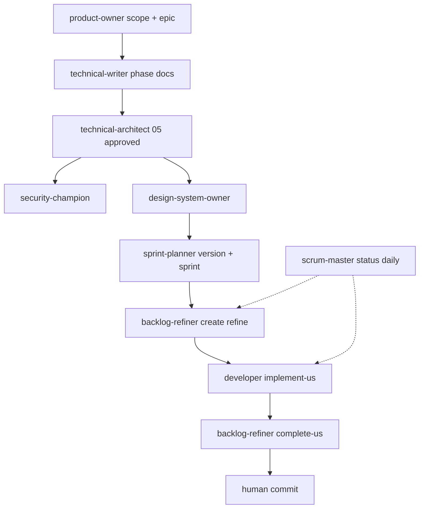

# Agent roster v11 — nomes Scrum/ágil e redesign

> **Status:** decisão de design — jul/2026 (fechada para H1)  
> **Princípio:** cada agente = **papel reconhecível em Scrum ou em enablement ágil** — não metáforas genéricas (`keeper`, `guardian`, `manager` que implementa código).  
> **Humano:** continua **Product Owner de fato** (prioriza, aprova, commita). Agentes **facilitam e executam** no protocolo Meridian.

---

## 1. Por que renomear

| Nome atual | Problema | Nome alvo |
| ---------- | -------- | --------- |
| `process-manager` | Soa como PM que **codifica**; Scrum já tem **Scrum Master** para facilitar o processo | `scrum-master` |
| `board-keeper` | Kanban/board não é cerimônia Scrum; o trabalho é **refino de backlog** + DoD na US | `backlog-refiner` |
| `architecture-guardian` | “Guardian” não é papel ágil | `technical-architect` |
| `security-steward` | OK mas “champion” é o termo enablement comum | `security-champion` |
| `documentation-strategist` | Muito vago | `technical-writer` |
| `scope-architect` | Sobrepõe PO na fase charter | **absorvido por** `product-owner` |
| _(ausente)_ | Development Team entrega incremento | `developer` |
| _(ausente)_ | Design system / UX enablement | `design-system-owner` |

---

## 2. Roster alvo — 10 agentes (+ enablers)

```txt
CAMADA SCRUM          AGENTE (slug)           ARTEFATOS / COMANDOS
────────────────────────────────────────────────────────────────────
Product Owner         product-owner           00_scope, discovery/, /discover, /create-epic
Enabler (docs)        technical-writer        01–08, 11 (phase docs)
Enabler (security)    security-champion       02_security, /security-pass, /security-review, /dependency-audit
Enabler (architecture) technical-architect    05_architecture, docs/architecture/, /architecture
Enabler (design)      design-system-owner     09_design_system, /design-pass, /design-showcase, /design-review
Enabler (quality)     quality-owner           10_test_strategy, /test-pass, /test-review
Sprint planning       sprint-planner          versions, sprints, /create-version, /plan-sprint, /complete-sprint
Backlog refinement    backlog-refiner         /create-us, /review-us, /refine-us, /complete-us
Development Team      developer               /implement-us (gate + código)
Scrum Master          scrum-master            /status, /daily-with-ai, /init-meridian, governança
```

**Priorização:** só o **humano** prioriza backlog (MoSCoW, ordem na sprint). Agentes não reordenam sozinhos.

---

## 3. Mapa cerimônia → agente (fiel ao `scrum-meridian-map.md`)

| Cerimônia Scrum | Comandos Meridian | Agente |
| --------------- | ----------------- | ------ |
| Product discovery / visão | `/discover`, charter | `product-owner` |
| Definição de produto (escopo) | `00_scope.md` | `product-owner` |
| Enabler: especificação técnica | phase docs | `technical-writer` |
| Enabler: arquitetura | `/architecture` | `technical-architect` |
| Enabler: segurança | `/security-pass`, `/security-review`, `/dependency-audit` | `security-champion` |
| Enabler: design system | `/design-pass`, `/design-showcase`, `/design-review` | `design-system-owner` |
| Enabler: qualidade | `/test-pass`, `/test-review` | `quality-owner` |
| Release / versão | `/create-version` | `sprint-planner` |
| Sprint planning | `/plan-sprint`, `/create-sprint` | `sprint-planner` |
| Backlog refinement | `/create-us`, `/review-us`, `/refine-us` | `backlog-refiner` |
| Implementação (incremento) | `/implement-us` | `developer` |
| Inspeção / DoD na US | `/complete-us` | `backlog-refiner` |
| Sprint review / retro (doc) | `/complete-sprint` | `sprint-planner` |
| Daily / impedimentos / status | `/daily-with-ai`, `/status` | `scrum-master` |
| Bootstrap projeto | `/init-meridian` | `scrum-master` + skills |

---

## 4. Fichas resumidas

### 4.1 `product-owner`

| | |
| - | - |
| **Scrum** | Product Owner (descoberta + épico + escopo — humano prioriza) |
| **Missão** | Problema, usuários, valor, `00_scope.md`, `docs/discovery/`, epics no SQLite |
| **Skills** | `discover-product`, `create-epic`, `update-decisions-log`, `meridian-routing` |
| **Não faz** | Implementar código; refinar Plan técnico de US; fechar sprint |

Absorve o antigo `scope-architect` (`00_scope` é charter do produto — trabalho de PO antes do backlog executável).

### 4.2 `technical-writer`

| | |
| - | - |
| **Scrum** | Enabler / specialist (documentação de fundação) |
| **Missão** | Phase docs `01`–`08`, `11` — stack, princípios, ambientes, stub decisões |
| **Skills** | `init-project`, `update-decisions-log`, `meridian-routing` |
| **Não faz** | US; código; arquitetura gate (`05` → `technical-architect`) |

### 4.3 `technical-architect`

| | |
| - | - |
| **Scrum** | Architect / Tech Lead (enablement) |
| **Missão** | `05_architecture.md`, `docs/architecture/*`, gate antes do backlog |
| **Skills** | `security-review` (leitura), `update-decisions-log`, `meridian-routing` |

### 4.4 `security-champion`

| | |
| - | - |
| **Scrum** | Security champion (time/enabler) |
| **Missão** | `02_security.md`, threat model, hygiene para agentes |
| **Skills** | `security-review`, `update-decisions-log` |

### 4.5 `design-system-owner`

| | |
| - | - |
| **Scrum** | Enabler (UX / design system — SAFe “System Team” para UI) |
| **Missão** | `docs/09_design_system.md` — tokens, componentes, responsive, a11y baseline |
| **Skills** | `design-system` (novo), `update-decisions-log` |
| **Workflow** | `/design-pass` — **recomendado** quando Acceptance menciona UI/layout/visual; não obrigatório para US só backend |
| **Gate** | US Must com critérios visuais → Plan cita `09_design_system.md` (após doc `approved`) |

### 4.5b `quality-owner`

| | |
| - | - |
| **Scrum** | Enabler (qualidade / test strategy) |
| **Missão** | `docs/10_test_strategy.md` — pirâmide, runners, cobertura; `/test-pass`, `/test-review` |
| **Skills** | `test-strategy`, `update-decisions-log` |
| **Workflow** | `/test-pass` — quando `tests: required` em Must US ou CI no escopo |
| **Gate** | US Must com `tests: required` → Plan cita `10_test_strategy.md` (após doc `approved`) |

### 4.6 `sprint-planner`

| | |
| - | - |
| **Scrum** | Facilitador de Sprint Planning + release |
| **Missão** | `versions`, `sprints` no SQLite; fechar sprint com retrospectiva |
| **Skills** | `create-version`, `create-sprint`, `complete-sprint`, `meridian-routing` |

### 4.7 `backlog-refiner`

| | |
| - | - |
| **Scrum** | Backlog refinement (qualidade do PBI / DoR / evidência no close) |
| **Missão** | Ciclo US: create → review → refine (`ready: true`) → complete (`Record`, ✅) |
| **Skills** | `create-user-story`, `review-user-story`, `refine-user-story`, `complete-user-story`, `sqlite-delivery-operations` |
| **Não faz** | Código de produto (`developer`); épico (`product-owner`) |

### 4.8 `developer`

| | |
| - | - |
| **Scrum** | Developer (Development Team) |
| **Missão** | `implement-gate` exit 0 → código alinhado ao Plan; **não** fecha US |
| **Skills** | `implement-user-story`, `code-quality-at-us-time` (via refs), `meridian-routing` |
| **Proibições** | `create-us`, `complete-us`, escopo novo, código sem US `ready: true` |

### 4.9 `scrum-master`

| | |
| - | - |
| **Scrum** | Scrum Master (facilita processo; não é o PO humano) |
| **Missão** | Maturidade de docs, `/status`, impedimentos, `/daily-with-ai`, init; **nunca** código de produto |
| **Skills** | `init-project`, `meridian-routing`, `update-decisions-log` |
| **Remove** | `implement-user-story` do frontmatter |

---

## 5. Fluxo de entrega (v11)



---

## 6. Decisões fechadas (manager delegou)

| # | Decisão |
| - | ------- |
| 1 | Slug **`developer`** — papel Scrum explícito, não “implementation-specialist” |
| 2 | Slug **`scrum-master`** — substitui `process-manager` para facilitação |
| 3 | Slug **`backlog-refiner`** — substitui `board-keeper` |
| 4 | Épico fica com **`product-owner`** + skill `create-epic` (não technical-writer) |
| 5 | **`scope-architect`** deixa de existir — merge em `product-owner` |
| 6 | `/design-pass` **recomendado** se Acceptance tem UI; obrigatório só para US Must visuais após `09_design_system` `approved` |
| 7 | Renomeação em **H1**: criar novos `.md` + aliases de routing 1 sprint; **H2**: remover arquivos antigos |

---

## 7. Migração (slug antigo → novo)

| Antigo | Novo | H1 action |
| ------ | ---- | --------- |
| `process-manager` | `scrum-master` | novo arquivo; routing aceita ambos |
| `board-keeper` | `backlog-refiner` | novo arquivo; routing aceita ambos |
| `architecture-guardian` | `technical-architect` | rename ou alias |
| `security-steward` | `security-champion` | rename ou alias |
| `documentation-strategist` | `technical-writer` | rename ou alias |
| `scope-architect` | `product-owner` | deprecar arquivo; texto merge no PO |
| _(novo)_ | `developer` | criar |
| _(novo)_ | `design-system-owner` | criar |

**Compatibilidade:** H3 ✅ — sem aliases de chat; use slugs v11.

Contrato histórico H2: removido (`agent-aliases-h2.md` deletado).

---

## 8. O que não criar (agora)

| Papel | Motivo |
| ----- | ------ |
| `test-engineer` | `tests` + gate + `complete-us` Record bastam |
| `devops-engineer` | `08_environments` + human no go-live |
| `database-architect` | `06_database` + `technical-architect` |

---

## 9. Onda H — checklist atualizado

### H1 — Criar / renomear agentes

- [x] `agents/developer.md`
- [x] `agents/scrum-master.md` (from process-manager, sem implement)
- [x] `agents/backlog-refiner.md` (from board-keeper)
- [x] `agents/design-system-owner.md`
- [x] `agents/technical-writer.md` (from documentation-strategist)
- [x] `agents/technical-architect.md` (from architecture-guardian)
- [x] `agents/security-champion.md` (from security-steward)
- [x] Expandir `agents/product-owner.md` (scope + epic)
- [x] `skills/design-system/SKILL.md`, `workflows/design-pass.md`
- [x] Routing matrix + `agents-help.md` + `scrum-meridian-map.md` § Ceremonies
- [x] H2: 6 arquivos legacy deletados
- [x] H3: aliases de chat removidos (`agent-aliases-h2.md` deletado)

### H2 + H3 — Limpeza ✅

- [x] `validate_meridian.py` bloqueia arquivos legacy e slugs em docs operacionais
- [x] Deletar 6 arquivos legacy + `agent-aliases-h2.md`
- [x] `sync_cursor_kit.sh`
- [ ] Validator warning: UI US sem ref `09_design_system` (opcional)

---

## 10. Integração onda G

Ao revisar cada `.md` do kit, usar **somente** os slugs da §2. Tabela de vocabulário em `markdown-audit-v11.md` §10 será atualizada em H1.

---

*Próximo passo executável: H1 — criar `developer.md` + `scrum-master.md` + routing; em paralelo G2 templates.*
