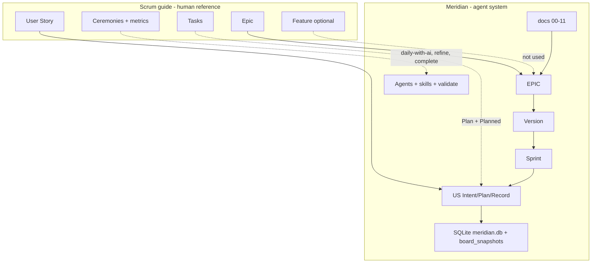

# Scrum ↔ Meridian map

> **Audience:** humans (managers) and agents executing Meridian workflows.  
> **Agents:** use **this file** for Scrum concepts in Meridian. Do **not** load `scrum-guide-complete.md` unless the manager explicitly asks for the full Scrum textbook.

Meridian is **Scrum-inspired governance for AI-assisted delivery**, not a co-located Scrum team tool. We keep phase docs in Markdown, delivery in SQLite, evidence-based status, and a minimal agent loop.

---

## Synthesis (visual)

> **Extension / kit:** this Mermaid block is the canonical Scrum ↔ Meridian map. Keep the fence in sync with any extension copy if you add one.



ASCII equivalent (IDEs without Mermaid preview):

```txt
Scrum (top, reference)  → maps ↓  Meridian (below, top → bottom)
──────────────────────────────────────────────────────────────
Épico                 →   SQLite `epics` (EPIC-XX)
Feature (opcional)    →   (omit — épico → US)
User Story            →   SQLite `user_stories` (US-XXXX)
Task / Subtask        →   ## Plan (Approach + Planned) — no tasks/ folder
Bug                   →   US de correção ou fix na US da sprint
Spike                 →   US com timebox em Notes OU `prepend-decision`
Product Backlog       →   `user_stories` + epics (MoSCoW, depends_on)
Sprint Backlog        →   `user_stories.sprint_id` (+ sprint `stories:` / `stories_json` cache)
Cerimônias            →   comandos abaixo (assíncrono, sem timebox rígido)
PO / priorização      →   gestor humano (agentes não priorizam sozinhos)
Velocity / burndown   →   não usados (capacidade = julgamento + Must + deps)
```

---

## Artifact mapping

| Scrum / Jira concept | Meridian | Notes |
| -------------------- | -------- | ----- |
| Product | `docs/` + phase `00`–`11` | Spec before code |
| Epic | SQLite `epics` | May span versions; prefer **new epic** over reopening `complete` |
| Feature | — | Intentionally skipped for small products (valid in Scrum too) |
| User story | SQLite `user_stories` | Schema v2: Intent / Plan / Record / Boundaries in `body_markdown` |
| Task / subtask | `## Plan` → Approach, Planned | No separate task files |
| Bug | US with fix acceptance | In-sprint bug: fix inside current US; production: new US + version patch |
| Spike | US (Notes: timebox) or `prepend-decision` | Outcome = knowledge, not production code |
| Release / version | SQLite `versions` | Hotfix versions (v1.1) allowed anytime |
| Sprint | SQLite `sprints` | Child of `version`; US allocation via `sprint_id` or sprint `stories:` |
| Product backlog | `user_stories` + epics | US without `sprint_id`; MoSCoW + deps |
| Sprint backlog | US with `sprint_id` on active/planned sprint | One sprint per US; order = `sprint_position` |
| Kanban board | Extension reads `meridian_db_export --format planning` | Columns derived: 📋 Backlog (`❌` + `ready: false`), 📌 Todo (`❌` + `ready: true`), then status/tests; card meta shows `sprint` when set |
| Definition of Done | `04_principles.md` + `/complete-us` | Global DoD in principles; CA per US in Intent |
| Story points / velocity | — | Not in Meridian (simplicity) |

---

## Ceremonies → Meridian commands

| Scrum ceremony | Meridian equivalent | Who |
| -------------- | ------------------- | --- |
| Backlog refinement | `/create-us`, `/review-us`, `/refine-us` | Manager + `backlog-refiner` |
| Sprint planning | `/plan-sprint` + sprint `stories:` order | Manager + `sprint-planner` |
| Daily Scrum | `/daily-with-ai` or `/status` + extension Help panels | Manager |
| Sprint review (demo) | Manager reviews increment against Acceptance + Planned | Manager |
| Sprint retrospective | `/complete-sprint` — fill `## Retrospective`, `status: complete` | Manager + `sprint-planner` |

No fixed 15-minute daily or 8-hour planning timeboxes — async manager + AI sessions.

---

## Roles → Meridian

| Scrum role | Meridian |
| ---------- | -------- |
| Product Owner | **Human manager** — priority, scope, accepts release |
| Scrum Master | **`scrum-master`** — gates, blockers, routing (not task assignment) |
| Development team | Implementing agent + manager reviews diff |
| Stakeholders | Outside agents — Sprint review is human |

**Agents must not:** auto-prioritize backlog, mark `approved` on phase docs, or mark `✅` without evidence and filled `## Record`.

---

## INVEST (user stories)

Use at `/review-us` and `/refine-us` — qualitative, no story points:

| Letter | Check in Meridian |
| ------ | ----------------- |
| **I**ndependent | `depends_on` minimal; slice stands alone |
| **N**egotiable | Intent/Why allow scope tradeoffs before code |
| **V**aluable | Why + `so that` in story preamble |
| **E**stimable | Plan/Approach concrete after refine |
| **S**mall | Fits one implementation session; else split US |
| **T**estable | Observable Acceptance + Planned steps |

If a story feels like 13+ points in Scrum terms → split into multiple US files.

---

## Bugs and spikes (no new artifact types)

### Bugs

1. **Found while implementing current US** — fix in place; update Record on close.
2. **Found in shipped behavior** — `/create-us` with correction acceptance; prioritize via MoSCoW and sprint/version.
3. **Critical production** — patch version (e.g. v1.1) + Must US; log decision.

Do not create `docs/bugs/` or Jira-style bug IDs.

### Spikes

1. **Timeboxed investigation** — US with clear question in Intent, `tests: none`, timebox in `### Notes`, Boundaries: no production deliverable.
2. **Outcome** — `prepend-decision`; optional follow-up US for implementation.

---

## Epic lifecycle (reopen policy)

When more work appears after `status: complete`:

- **Large evolution** → new `EPIC-YY` referencing the closed epic in Notes.
- **Small follow-up** (1–2 US) → related active epic or new small epic — manager decides.
- **Avoid** reopening `complete` epics for metrics clarity (Scrum best practice).

---

## Sprint scope (active sprint)

When sprint `vX-SY` has `status: active` in SQLite:

- **Manager** owns the commitment; agents do not add US to the sprint without explicit request.
- New urgent items → product backlog (`user_stories`) or next sprint; log scope change via `prepend-decision` if the sprint goal shifts.
- **Sprint review:** before `status: complete`, manager confirms increment against sprint `goal` and US Acceptance.
- **Retrospective:** mandatory fields on sprint close (even one line each).

Sprint planning uses **Must US + `ready` + `depends_on` + human capacity** — not Fibonacci velocity. Each US in the sprint has **`sprint_id`** set (via US `sprint:` or sprint `stories:`); at most one sprint per US.

---

## Definition of Done (project-level)

Record the team’s global DoD in **`docs/04_principles.md`** (section “Definition of Done”). Typical Meridian alignment:

- Acceptance criteria evidenced in US Intent
- Build/lint/test per `04_principles` and US `tests`
- `## Record` filled with real paths; `tests_status: done` when required
- `status: ✅` only via `/complete-us`
- `board_snapshots` updated on upsert; human git commit per closed US (unless batched intentionally)
- Cross-cutting changes via `prepend-decision`

Per-story criteria stay in **Intent / Acceptance** — not duplicated as global DoD.

---

## What we deliberately do not import from Scrum

- Story points, velocity, burndown charts as required fields
- Mandatory Feature layer or `docs/tasks/`
- Scrum Master / PO agents that decide priority alone
- Ceremony duration enforcement
- SAFe / multi-team scaling
- Jira/Linear as source of truth (optional external tools only)

---

## Human deep dive (optional)

Full Scrum guide (onboarding): **[scrum-guide-complete.md](./scrum-guide-complete.md)** — read when learning Scrum; not loaded by default in agent sessions.

Kit entry points: [start-here.md](./start-here.md) · [usage-guide.md](./usage-guide.md) · [agents-help.md](./agents-help.md) · [MERIDIAN.md](../MERIDIAN.md)

App (monitor): **How it works** tab → section “Scrum and Meridian”.
