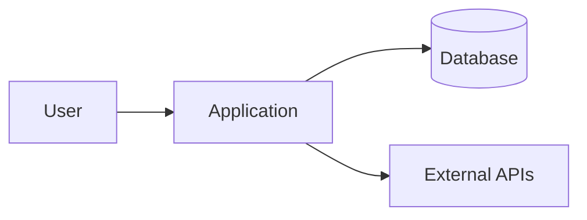

# Phase doc template — `05_architecture.md`

**Agent:** `technical-architect` — `/architecture`  
**Product path:** `docs/05_architecture.md`  
**Gate:** `status: approved` required before epics/US in SQLite

---

## What this document is for

`05_architecture` describes **system shape**: major components, layers, integrations, and key flows. It is the **backlog gate**. Overview stays here; deep specs move to `docs/architecture/*.md` per `architecture-folder-guide.md`.

No user story should be created while this doc is only placeholder text.

## When to write and revisit

| Moment | Action |
| ------ | ------ |
| Init | Draft context + layers from repo or planned structure |
| `/architecture` workflow | Deepen before approval: flows, detail files, security cross-check |
| New epic crosses boundary | Update components + integrations; `review` |
| Refactor changes module boundaries | Update layers table + `04`; log decision |

## How to complete each section

### Objective

1–2 sentences: what this doc covers and what belongs in detail files instead.

### System context

Replace generic mermaid with **real** components. Mode B: verify folder names. Add repository layout tree matching actual monorepo/apps structure.

### Layers and boundaries

Table must mirror `04_principles` layer names. Add paths column — where code lives.

### Major components

Each deployable or significant module: purpose, tech, owner path.

### Integration points

External systems: direction, protocol, auth, failure handling (retry, circuit breaker, fail fast).

### Key flows

Numbered steps for authentication and primary user journey. Init may stub; **required before `approved`**. Use profile names from `03`.

### Architecture detail files

Index table — link to `docs/architecture/*.md` or state “none yet; split when § X exceeds ~100 lines”.

### Cross-cutting concerns

Auth, logging, feature flags — pointer to owning doc (`02`, `08`, etc.).

### Mode B — as-is vs target

When migrating, document current vs target architecture to guide epics.

### Gaps

Items blocking backlog — mark if blocks epic creation.

## Depth checklist

- [ ] Diagram or tree matches repository
- [ ] Layers consistent with `04`
- [ ] Integrations name real external systems or `_n/a_`
- [ ] Key flows complete for primary journey
- [ ] Security boundaries reflected (trust zones)


## Mid-project review (doc drift)

Phase docs are **living contracts**. Re-open this file when:

- Stack, auth, or deployment changes materially
- A US or epic introduces a new surface not covered here
- `/audit-docs` or validator flags gaps
- Before marking a new epic `active` if it touches this domain

**Procedure:** set `status: review` → edit sections → run cross-doc checks below → log via `/update-decisions-log` → human sets `approved` again. Never edit `approved` docs silently.

## Cross-doc checks

- Components use stack from `01`
- Flows use profiles from `03`
- Data stores match `06`
- APIs match `07`

## Gate

**Only human** sets `approved`. Agent never self-approves. Run `/architecture` before asking for approval.

## Related

- `architecture-folder-guide.md`, `/create-epic` (after approve)
---

## Document stub

> **Copy to product `docs/`:** from the opening `---` frontmatter below through the end of this section. Replace every `_(…)_` and empty table cell with real content. Do not copy this heading or the blockquote.

---
title: Architecture
status: draft
version: 1.0
updated: YYYY-MM-DD
depends_on: [00_scope.md, 01_tech_stack.md, 02_security.md, 03_user_types.md, 04_principles.md]
blocks: [06_database.md, 07_api_contracts.md, 08_environments.md, 09_design_system.md]
---

# 05 — Architecture

> **Gate:** `status: approved` required before epics, versions, and user stories in SQLite.

## Objective

_(1–2 sentences: what this document covers and what is out of scope — detail files vs overview.)_

## System context



_(Replace with real components — or `txt` tree for monorepos.)_

**Repository layout (high level):**

```txt
/
  src/ or apps/     # main product code
  docs/             # phase docs
  .agent/           # Meridian kit (if present)
```

## Layers and boundaries

| Layer | Responsibility | Paths | Depends on |
| ----- | -------------- | ----- | ---------- |
| | | | |

_Consistent with `04_principles` § Single responsibility._

## Major components

| Component | Purpose | Tech | Owner module |
| --------- | ------- | ---- | -------------- |
| | | | |

## Integration points

| System | Direction | Protocol | Auth | Failure mode |
| ------ | --------- | -------- | ---- | ------------ |
| | inbound / outbound | REST / gRPC / … | | retry / fail |

## Key flows

### Flow 1 — [name, e.g. sign-in]

1. _
2. _
3. _

### Flow 2 — [primary user journey]

1. _
2. _

## Architecture detail files

| File | Topic | Status |
| ---- | ----- | ------ |
| `docs/architecture/…` | | planned / draft |

_See `architecture-folder-guide.md` before adding files._

## Cross-cutting concerns

| Concern | Approach | Doc ref |
| ------- | -------- | ------- |
| Auth | | `02_security` |
| Logging | | |
| Feature flags | | |

## Mode B — as-is vs target

| Area | Current (evidence) | Target (if migrating) |
| ---- | ------------------ | --------------------- |
| | path | |

## Gaps / open questions

| # | Gap | Blocks backlog |
| - | --- | -------------- |
| 1 | | yes / no |

## Gate

Only **human** sets `status: approved`. Run `/architecture` before approval.

