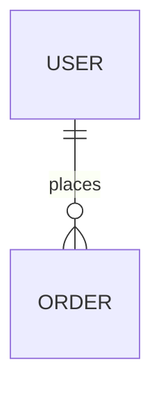

# Phase doc template — `06_database.md`

**Agent:** `technical-writer`  
**Product path:** `docs/06_database.md`  
**Depends on:** `05_architecture.md`

---

## What this document is for

`06_database` is the **persistence contract**: what is stored, schema overview, migrations, who may write, backup expectations. If persistence is external SaaS or flat files only, say so clearly — the doc is not optional when `.sql`, Prisma, or SQLite files exist.

## When to write and revisit

| Moment | Action |
| ------ | ------ |
| Init | Document existing schema (Mode B) or planned store (Mode A) |
| Every migration epic | Update entity list; link migration id |
| PII scope change | Update PII column; sync `02` classification |
| Backup/DR requirement change | Update backup section |

## How to complete each section

### Persistence model

Table: store type, ORM, connection env var **names**, multi-tenant key if any.

### Schema overview

Entity list with purpose and PII flag. ER diagram or link to `docs/architecture/db.md` when large.

### Migrations

Tool, folder path, naming (`YYYYMMDDHHMMSS_description`), who runs migrations (dev, CI, release).

### Data access rules

Which layers may read/write — must align with `04` layers.

### Indexes, backup, security

Document when known; `_planned_` with owner in Gaps if not.

## Depth checklist

- [ ] Store type matches actual files in repo
- [ ] Migration path and tool named
- [ ] PII entities flagged
- [ ] No credentials in doc body

## Mid-project review (doc drift)

Phase docs are **living contracts**. Re-open this file when:

- Stack, auth, or deployment changes materially
- A US or epic introduces a new surface not covered here
- `/audit-docs` or validator flags gaps
- Before marking a new epic `active` if it touches this domain

**Procedure:** set `status: review` → edit sections → run cross-doc checks below → log via `/update-decisions-log` → human sets `approved` again. Never edit `approved` docs silently.

## Cross-doc checks

- Entities support `05` components
- API in `07` maps to entities here
- `02` retention aligns with backup section

## Gate

`approved` when schema matches deployed/dev reality.

## Related

- `architecture-folder-guide.md` for large schemas
---

## Document stub

> **Copy to product `docs/`:** from the opening `---` frontmatter below through the end of this section. Replace every `_(…)_` and empty table cell with real content. Do not copy this heading or the blockquote.

---
title: Database
status: draft
version: 1.0
updated: YYYY-MM-DD
depends_on: [05_architecture.md]
blocks: [07_api_contracts.md]
---

# 06 — Database

## Persistence model

| Attribute | Value |
| --------- | ----- |
| **Primary store** | PostgreSQL / SQLite / MongoDB / files / none |
| **ORM / client** | |
| **Connection config** | env var names — no secret values |
| **Multi-tenant** | yes / no — key column |

_If no database: explain persistence (local files, external SaaS only) in one paragraph._

## Schema overview

### Entity list

| Entity / table | Purpose | Owner service | PII? |
| -------------- | ------- | ------------- | ---- |
| | | | yes / no |

### Relationships

_Or link to `docs/architecture/db.md` when large._

## Migrations

| Rule | Value |
| ---- | ----- |
| Tool | Flyway / Prisma / Alembic / raw SQL / … |
| Folder | |
| Naming | `YYYYMMDDHHMMSS_description.sql` |
| Apply in CI | yes / manual |
| Rollback policy | |

## Data access rules

| Layer | May write DB | May read DB |
| ----- | ------------ | ----------- |
| API handlers | | |
| Domain | | |
| Scripts | | |

_Per `04_principles` — no UI writing DB directly._

## Indexes and performance

| Table | Index | Reason |
| ----- | ----- | ------ |
| | | |

_Optional at init; required before prod._

## Backup and restore

| Environment | Method | Frequency | RTO / RPO |
| ----------- | ------ | --------- | --------- |
| local | | n/a | |
| production | | | |

## Security

- Encryption at rest: _
- Row-level security / tenant filter: _
- See `02_security` § Data classification

## Gaps / open questions

| # | Gap | Evidence needed |
| - | --- | --------------- |
| 1 | | |

## Gate

Human `approved` when schema matches deployment reality (Mode B: cite migration files).

