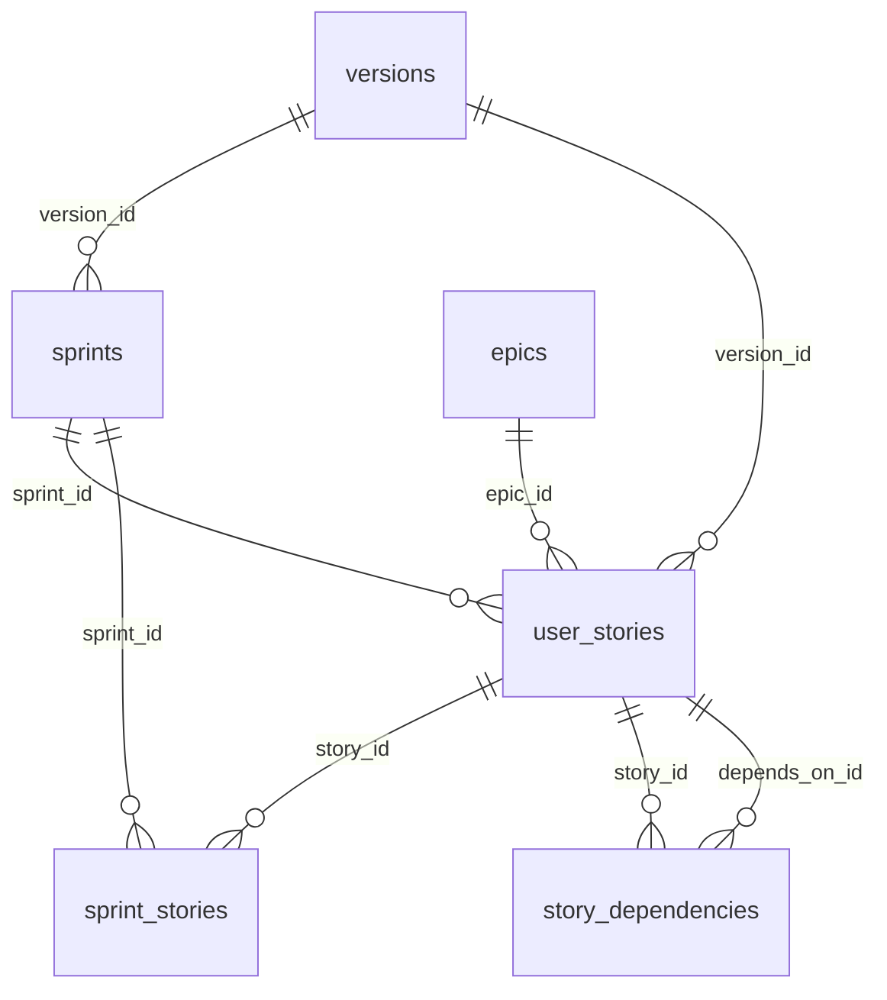

# SQLite delivery operations — agent reference

> **Facade (agents):** `python3 .agent/scripts/meridian_delivery.py` — reads `.meridian/delivery.json` (default connector: `sqlite`).  
> **This doc:** sqlite driver details. **Schema:** `delivery-connector-schema.md`.

> **Read this before INSERT/UPDATE on delivery store.** Prefer **`meridian_delivery.py`** over raw SQL. Phase docs (`00`–`11`) stay Markdown — never store them in SQLite.

## Location

| Item | Path |
| ---- | ---- |
| Database | `{packageRoot}/.meridian/meridian.db` |

**Forbidden:** `.meridian/drafts/`, `us-*-refine.md`, `us-*-complete.md`, `docs/us/*.md`. Kit “narrative draft” / “Plan draft” = `ready: false` in `user_stories`. Persist: `update-{us|epic|version|sprint}` with markdown on **stdin** (heredoc) only. Do not create scratch `.md` in the repo.

| Migrations | `.agent/migrations/YYYYMMDDHHMMSS_*.sql` |
| Access layer | `.agent/scripts/lib/meridian_db.py` |
| CLI | `.agent/scripts/meridian_delivery.py` (facade) → `meridian_db_cli.py` (sqlite driver) |

Dogfood `packageRoot` = repository root (`.`).

## Relational model (insert order matters)

```txt
1. versions          (no FK)
2. epics             (no FK; versions field is text JSON list)
3. user_stories      (FK: epic_id → epics.id, version_id → versions.id; sprint_id → sprints.id optional)
4. sprints           (FK: version_id → versions.id)
5. sprint_stories    (derived cache; UNIQUE story_id — rebuilt from user_stories.sprint_id or sprint `stories:` upsert)
6. story_dependencies (FK: story_id → user_stories.id, depends_on_id → user_stories.id)
7. decisions         (independent)
8. board_snapshots   (derived; auto on upsert via record_board_snapshot)
```

**FK failures** mean parent row missing — insert version and epic before user story; sprint row must exist before setting `sprint_id` on a US.



**Sprint link (canonical on US):** frontmatter `sprint: vX-SY` or sprint frontmatter `stories: [US-…]` — both converge on `user_stories.sprint_id`. `bootstrap_meridian_db.py` (also run on **Upgrade harness**) applies migrations and `reconcile_sprint_links()` for legacy DBs.

## Agent workflow (summary-first)

```bash
# 1. Bootstrap / migrate
python3 .agent/scripts/bootstrap_meridian_db.py .
python3 .agent/scripts/migrate_md_to_sqlite.py .   # one-time if legacy .md exist

# 2. Discover (no full bodies)
python3 .agent/scripts/meridian_delivery.py counts .
python3 .agent/scripts/meridian_delivery.py list user_stories --version v10 --status ❌
python3 .agent/scripts/meridian_delivery.py search "parity" --entity user_stories

# 3. Read summary, then full only if implementing
python3 .agent/scripts/meridian_delivery.py show US-0115
python3 .agent/scripts/meridian_delivery.py show US-0115 --full

# 4. Write (never create docs/us/*.md when DB exists)
python3 .agent/scripts/meridian_delivery.py create-version --id v11 --title "Release name"
python3 .agent/scripts/meridian_delivery.py create-epic --title "Capability name" --versions "[v11]"
python3 .agent/scripts/meridian_delivery.py create-sprint --version v11 --title "Sprint name" --stories US-0001
python3 .agent/scripts/meridian_delivery.py create-us --title "..." --epic EPIC-15 --version v10
python3 .agent/scripts/meridian_delivery.py update-us US-0115 <<'EOF'
---
id: US-0115
...
---
# US body
EOF
python3 .agent/scripts/meridian_delivery.py update-epic EPIC-15 <<'EOF'
---
id: EPIC-15
...
---
# Epic body
EOF
python3 .agent/scripts/meridian_delivery.py update-version v11 <<'EOF'
---
id: v11
...
---
# Version body
EOF
python3 .agent/scripts/meridian_delivery.py update-sprint v11-S1 <<'EOF'
---
id: v11-S1
...
---
# Sprint body
EOF

# 4b. Extension form API (VS Code UI only — not agents)
python3 .agent/scripts/meridian_db_export.py . --entity us --id US-0115 --format form
python3 .agent/scripts/meridian_db_export.py . --entity epics --id EPIC-15 --format form
# stdin: JSON { frontmatter, preamble, sections } — see meridian_delivery_form.py
python3 .agent/scripts/meridian_db_export.py . --entity us --id US-0115 --write-form < form.json

python3 .agent/scripts/meridian_delivery.py implement-gate US-0115
python3 .agent/scripts/meridian_delivery.py implement-gate US-0115 --json
python3 .agent/scripts/meridian_delivery.py set-ready US-0115 --ready true
python3 .agent/scripts/meridian_delivery.py set-summary US-0115 --text "4-8 sentence summary"
python3 .agent/scripts/meridian_delivery.py prepend-decision \
  --date "$(date +"%Y-%m-%d")" --time "$(date +"%H:%M")" \
  --title "..." --affected-document "docs/05_architecture.md" \
  --what-changed "..." --why-changed "..." --impact "..." --responsible "..."

# 5. Validate
python3 .agent/scripts/validate_meridian.py .
python3 .agent/scripts/validate_meridian.py . --sqlite-only   # after purge
```

## Inspect without CLI (sqlite3)

```bash
sqlite3 .meridian/meridian.db "SELECT id, title, status, ready, sprint_id FROM user_stories WHERE version_id='v10' ORDER BY id;"
sqlite3 .meridian/meridian.db "SELECT id, sprint_id, sprint_position, ready FROM user_stories WHERE sprint_id IS NOT NULL ORDER BY sprint_id, sprint_position;"
sqlite3 .meridian/meridian.db "SELECT ss.sprint_id, ss.story_id, ss.position FROM sprint_stories ss JOIN sprints s ON s.id=ss.sprint_id WHERE s.version_id='v10';"
sqlite3 .meridian/meridian.db "PRAGMA foreign_key_list(user_stories);"
```

## Upsert patterns (use meridian_db.py — do not duplicate)

| Entity | Function | Notes |
| ------ | -------- | ----- |
| Version | `upsert_version(conn, fm, body, sections)` | `sections` from `extract_version_sections` |
| Epic | `upsert_epic(conn, fm, body, sections)` | |
| User story | `upsert_user_story(conn, fm, body, sections, depends_on)` | `sprint` in FM → `sprint_id`; blocks `ready: true` without open sprint |
| Sprint | `upsert_sprint(conn, fm, body, sections, stories)` | `stories` sets each US `sprint_id`, rebuilds `sprint_stories` + `stories_json` |

`body` = full markdown with YAML frontmatter. Section columns are extracted by `meridian_markdown_parse.py` on every upsert.

### User story — section → column

| `###` under | Column |
| ----------- | ------ |
| Intent / Acceptance | `intent_acceptance` |
| Intent / Why | `intent_why` |
| Intent / Where | `intent_where` |
| Plan / Approach | `plan_approach` |
| Plan / Architecture refs | `plan_architecture_refs` |
| Plan / API / DB impact | `plan_api_db` |
| Plan / Security notes | `plan_security` |
| Plan / Related decisions | `plan_decisions` |
| Plan / Planned | `plan_planned` |
| Record / Files | `record_files` |
| Record / Backend | `record_backend` |
| Record / Frontend | `record_frontend` |
| Record / Scripts / Docs | `record_scripts` |
| Record / Executed | `record_executed` |
| Boundaries / Out of scope for this story | `boundaries_out_of_scope` |
| Boundaries / Notes | `boundaries_notes` |

Plus `body_markdown` (full file) and `summary`. Full contract: `section-contracts.md`.

## Verification and purge

```bash
python3 .agent/scripts/verify_md_sqlite_parity.py .          # exit 0 = safe to purge
python3 .agent/scripts/backfill_summaries.py .                 # fill NULL summaries
python3 .agent/scripts/purge_delivery_md.py . --dry-run
python3 .agent/scripts/purge_delivery_md.py . --require-verify
```

## Forbidden when `--sqlite-only` is active

- `Write` on `docs/us/`, `docs/epics/`, `docs/versions/`, `docs/sprints/`, `docs/decisions/*.json`
- Creating delivery `.md` “for convenience” — use CLI upsert only

## Templates for narrative structure

| Artifact | Markdown shape template |
| -------- | ----------------------- |
| User story | `.agent/skills/create-user-story/references/us-template.md` |
| Epic | `.agent/skills/create-epic/references/epic-template.md` |
| Version | `.agent/skills/create-version/references/version-template.md` |
| Sprint | `.agent/skills/create-sprint/references/sprint-template.md` |

Parse → upsert via CLI; do not hand-edit SQL for narrative bodies unless emergency.

## Structured form API (extension only)

> **Agents:** use `update-*` with stdin heredoc — not `--write-form`.

| Step | Command / module |
| ---- | ---------------- |
| Export fields | `meridian_db_export.py --entity {us\|epics\|versions\|sprints} --id ID --format form` |
| Import + validate | `meridian_db_export.py … --write-form` (JSON stdin) |
| Build/validate | `.agent/scripts/lib/meridian_delivery_form.py` (shim at `meridian_delivery_form.py`) |

JSON shape: `{ "frontmatter": {…}, "preamble": "…", "sections": { column_key: "markdown body" }, "catalog": { stories, epics, versions, sprints } }` (catalog on US export only).

US `depends_on` in the form is a **multi-select picker** of story PKs (`US-XXXX`). US `sprint` is a **select** from `catalog.sprints` (same version). Save validates FK, rejects self-reference and cycles. `/implement-us` gate: every `depends_on` US must be `status: ✅`; sprint must be `planned`/`active` (`validate_story_open_sprint` in `meridian_db.py`).

Section keys match `extract_*_sections` in `meridian_markdown_parse.py` (e.g. US `intent_acceptance`, epic `capability`). Save runs `validate_*_structure` before upsert — invalid templates are rejected.

Extension: primary **Edit** uses `--write-form`; raw `--write` only under **Advanced** with confirmation.
