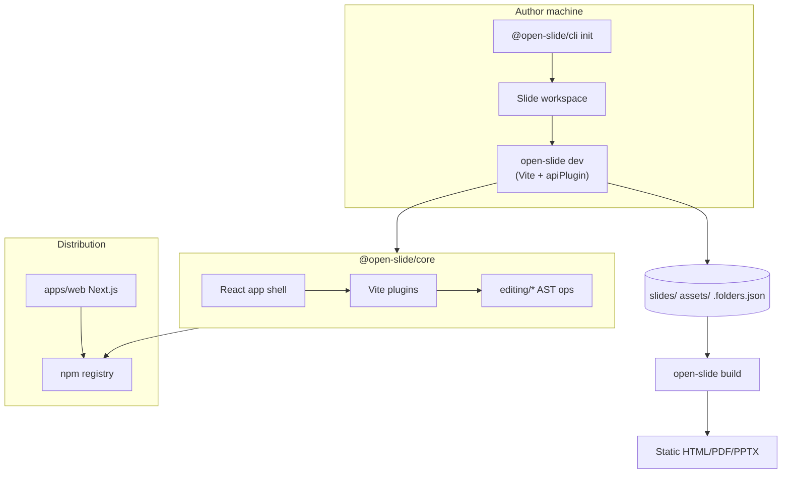

# 05 — Architecture

> **Gate:** `status: approved` required before epics, versions, and user stories in SQLite.

## Objective

Descrever a estrutura do monorepo open-slide, fluxos principais (dev, present, export) e fronteiras entre runtime publicado, CLI, apps internos e harness Meridian na raiz do git.

## System context



**Repository layout (harness + product):**

```txt
/                          # Meridian harness root
  .agent/                  # Kit Meridian
  .meridian/               # meridian.db, projects.json, delivery.json
  docs/                    # Phase docs (este produto)
  open-slide/              # Monorepo npm (@open-slide/*)
    packages/core/
    packages/cli/
    apps/demo/
    apps/web/
```

## Layers and boundaries

| Layer | Responsibility | Paths | Depends on |
| ----- | -------------- | ----- | ---------- |
| Public SDK | Stable exports for slide authors | `packages/core/src/index.ts`, `locale/` | React |
| App shell | Viewer, inspector, present, home | `packages/core/src/app/` | SDK, design tokens |
| Vite integration | Dev server, HMR, virtual modules | `packages/core/src/vite/` | Vite API |
| Dev HTTP API | Mutate workspace during dev | `packages/core/src/vite/routes/` | `editing/*`, `files/*` |
| Editing engine | Babel TSX transforms | `packages/core/src/editing/` | filesystem |
| CLI | dev/build/preview/sync commands | `packages/core/src/cli/` | vite, config |
| Scaffold CLI | `init` template copy | `packages/cli/` | template/ |
| Marketing | Docs site | `apps/web/` | Next, Fumadocs |
| Meridian delivery | Backlog SQLite | `.meridian/` at harness root | Python kit |

## Major components

| Component | Purpose | Tech | Owner module |
| --------- | ------- | ---- | -------------- |
| `openSlidePlugin` | Wire plugins + app index | Vite | `vite/open-slide-plugin.ts` |
| `apiPlugin` | Register `__*` routes | Connect middleware | `vite/api-plugin.ts` |
| `Player` / routes | Slide viewing | React Router | `app/routes/*` |
| Inspector | Comment + edit overlay | React context | `app/components/inspector/*` |
| Folder manifest | Deck organization | JSON file | `files/folders.ts` |
| Design plugin | Inject CSS variables | Vite | `vite/design-plugin.ts` |
| Changesets release | Version npm packages | changesets | root scripts |

## Integration points

| System | Direction | Protocol | Auth | Failure mode |
| ------ | --------- | -------- | ---- | ------------ |
| npm registry | outbound | HTTPS | publish token | Release job fails |
| svgl.app (via proxy) | outbound | HTTPS | none | Dev search degrades |
| GitHub Actions | outbound | HTTPS | GITHUB_TOKEN | CI red |
| Playwright container | local CI | Docker image | — | e2e job fails |

## Key flows

### Flow 1 — Author edits via inspector comment

1. Author opens slide in dev server; inspector captures element location.
2. Comment persisted as `@slide-comment` in TSX (`comments.ts` route + plugin).
3. Agent runs `/apply-comments` skill; calls `/__edit` or batch with AST ops.
4. Vite HMR reloads slide module.

### Flow 2 — Scaffold new workspace

1. User runs `npx @open-slide/cli init my-deck`.
2. CLI copies `template/` including `.claude/skills` symlinks/copies.
3. User `pnpm dev` → core CLI launches Vite with consumer `open-slide.config.ts`.
4. Slides discovered from `slides/**/index.tsx`.

### Flow 3 — Present and export

1. Author navigates to present route; `presenter.tsx` loads slide module pages.
2. Keyboard/touch navigation via hooks in `components/present/*`.
3. **Static deploy:** `open-slide build` → Vite `dist/` (no dev APIs).
4. **In-browser export:** HTML/PDF/PPTX via `app/lib/export-*.ts` (client-only). See [architecture/export-pipeline.md](architecture/export-pipeline.md).

## Trust zones

| Zone | Network exposure | Mutates disk | APIs |
| ---- | ---------------- | ------------ | ---- |
| Consumer dev server | localhost by default; LAN if `--host` | yes (via `__*`) | `__*` + HMR |
| Static `dist/` / exported HTML | public when published | no | none |
| npm package | download only | no | — |
| Meridian harness | local | yes (`.meridian/`, docs) | Python CLI |
| Marketing site | public HTTPS | no (SSG/SSR read) | `/api/search` docs only |

## Architecture detail files

| File | Topic | Status |
| ---- | ----- | ------ |
| [architecture/vite-dev-api.md](architecture/vite-dev-api.md) | Dev server `__*` routes | approved |
| [architecture/instruction-surfaces.md](architecture/instruction-surfaces.md) | Onde ler regras (docs vs core/skills) | approved |
| [architecture/export-pipeline.md](architecture/export-pipeline.md) | build + HTML/PDF/PPTX export | approved |

## Cross-cutting concerns

| Concern | Approach | Doc ref |
| ------- | -------- | ------- |
| Auth | None for slides | `02_security` |
| CSRF on dev POST | `request-guard.ts` | `02_security`, `07_api_contracts` |
| i18n | Locale modules + store | `packages/core/src/locale` |
| Theming | next-themes + design tokens | `09_design_system` |

## Mode B — as-is vs target

| Area | Current (evidence) | Target (Meridian forward) |
| ---- | ------------------ | ------------------------- |
| Governance | Phase docs approved; SQLite backlog empty | Epics + US in `.meridian/meridian.db` |
| Repo root | Harness + product split | Done — `open-slide/` subfolder |
| Design tokens | `design.ts` + WIP slide-tokens | Document + gate in epics |

## Gaps / open questions

| # | Gap | Blocks backlog |
| - | --- | -------------- |
| 1 | Backlog SQLite vazio (epics/versions/US) | yes — run `/create-version`, `/create-epic` |
| 2 | Composed `App*` template catalog / showcase routes | no — optional `/design-showcase` |

## Gate

Only **human** sets `status: approved`. Run `/architecture` before approval.
