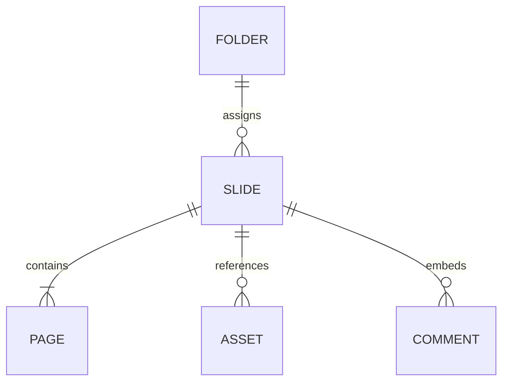

# 06 — Database

## Summary

open-slide **não usa SQL** para dados de slides. Persistência primária é **filesystem** no workspace do autor. Meridian delivery usa **SQLite** (`meridian.db`) separado do runtime npm.

## Application persistence (consumer workspaces)

| Store | Format | Path | Written by |
| ----- | ------ | ---- | ---------- |
| Slide source | TSX modules | `slides/<id>/index.tsx` | Author, agent, `/__edit` |
| Folder manifest | JSON | `slides/.folders.json` | `/__folders`, UI |
| Assets | Binary + metadata | `assets/` or per-deck paths | `/__assets`, author |
| Comments | TSX markers | inline in slide files | `/__comments`, inspector |
| Speaker notes | TSX / plugin extraction | slide source | notes plugin |
| Design tokens | CSS variables / config | `open-slide.config.ts`, design files | author, design plugin |

## Entity overview (logical)

| Entity | Purpose | PII? |
| ------ | ------- | ---- |
| Slide | Deck module exporting pages | no |
| Page | Step within slide default export | no |
| Folder | Grouping for UI | no |
| Asset | Media used by slides | no* |
| Comment | Inspector feedback thread | no |

\*User could embed PII in content — out of framework scope.

## Relationships

## Meridian SQLite (delivery)

| Table area | Purpose | Tooling |
| ---------- | ------- | ------- |
| epics, versions, sprints, user_stories | Backlog | `meridian_db_cli.py`, Board UI |
| decisions | Decision log | `prepend-decision` |
| board_snapshots | Planning export | `meridian_db_export.py` |

**Location:** `.meridian/meridian.db` (gitignored)  
**Bootstrap:** `python3 .agent/scripts/meridian_delivery.py --package-root . bootstrap`  
**Migrations:** `.agent/migrations/*.sql` applied by bootstrap/migrate scripts

## Migrations (application)

| Rule | Value |
| ---- | ----- |
| Tool | n/a for slide TSX |
| Meridian SQL | `.agent/migrations/YYYYMMDDHHMMSS_*.sql` |
| Naming | timestamp + description |
| Apply | bootstrap / kit upgrade |

## Data access rules

| Layer | May write slide files | May write meridian.db |
| ----- | --------------------- | --------------------- |
| React UI (dev) | via fetch to `__*` | no |
| Vite routes | yes | no |
| Meridian scripts | no product code | yes |
| CI | test fixtures only | no |

## Backup and restore

| Environment | Method | Notes |
| ----------- | ------ | ----- |
| Author workspace | git | Primary backup for decks |
| meridian.db | copy file | Optional export via kit |
| npm packages | registry immutable versions | changesets |

## Security

See `02_security` — path validation on asset/slide IDs; no encryption at rest for slides.

## Gaps / open questions

| # | Gap | Evidence needed |
| - | --- | --------------- |
| 1 | Formal schema doc for meridian.db columns | `\d` in bootstrap or kit ARCHITECTURE |

## Gate

Human `approved` when persistence model matches deployment reality.
