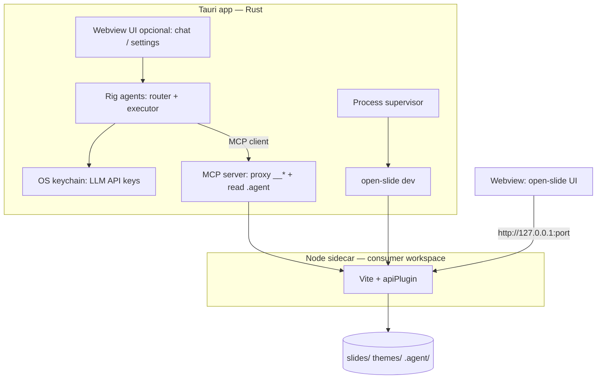

# Desktop app — Tauri + Rig (planned)

> **Status:** rascunho de direção futura — **não implementado**. O produto publicado hoje continua sendo framework npm + dev server Node (`open-slide dev`). Este arquivo existe para lembrar decisões de produto e arquitetura discutidas em 2026-07.

## Objetivo

Oferecer uma **experiência de app** para autores que não querem viver no terminal (`pnpm dev`), mantendo:

- **TSX/React** como fonte da verdade dos slides (sem substituir por WYSIWYG).
- O **slide kit** em `.agent/` (workflows, skills, `SLIDE-KIT.md`) como playbook — o mesmo que Cursor/Claude usam hoje.
- **Node** como runtime do Vite e das rotas dev `__*` (não migrar o motor para Deno/Rust no primeiro corte).

O app desktop **não substitui** o IDE para power users; **complementa** com shell, preview e (futuro) agente embutido.

## Problema que resolve

| Hoje | Com app (alvo) |
| ---- | -------------- |
| `npx @open-slide/cli init` + `pnpm install` + `pnpm dev` | Um ícone: escolher/criar pasta de workspace e **iniciar** |
| Skills/adapters exigem entender `sync:kit` e abrir o repo no agente | Setup guiado: IDE favorito + `open-slide sync:kit` (ou equivalente) na primeira execução |
| Loop agente ↔ preview assume Cursor/Claude na máquina | Opcional: **harness embutido** (Rig) que executa o mesmo kit via tools |

Fora deste epic (continua em `00_scope.md`): SaaS, contas na nuvem, colaboração em tempo real, editor drag-and-drop substituindo código.

## Decisões de stack (registro)

| Decisão | Escolha | Motivo |
| ------- | ------- | ------ |
| Shell desktop | **[Tauri](https://tauri.app/)** (Rust) | Webview nativa, binário enxuto para o *shell*, keychain para API keys, spawn de processos filhos |
| Agente embutido | **[Rig](https://rig.rs/)** (`rig-core` + MCP via `rmcp`) | Loop LLM + tools em Rust, alinhado ao backend Tauri; não reinventar protocolo de tools |
| Tools do agente | **MCP** (servidor fino em **Node** ao lado do Vite) | Reutilizar rotas `__*` e edição já existentes; mesmo servidor pode servir Cursor depois |
| Motor de slides | **Node** (sidecar) | Vite, `apiPlugin`, `editing/*` e CLI já são Node; Deno/Bun = matriz extra sem ganho claro no tamanho (~190 MB de `node_modules` domina) |
| Playbook do agente | **Slide kit** em `node_modules/@open-slide/core/.agent` → `.agent/` | Sem duplicar regras; Rig carrega workflows/skills como contexto + handoff (roteador → executor) |

**Não fazer no primeiro corte:** reescrever dev server em Rust; modelo local grande embutido; substituir o kit por prompts ad hoc.

## Contexto no sistema

O **preview** do deck é a mesma UI React do `@open-slide/core`; a webview só navega para o dev server local (porta conhecida via IPC — o supervisor do `dev` já pode reportar `open-slide:listening` ao processo pai).

## Componentes previstos (monorepo)

| Peça | Local sugerido | Responsabilidade |
| ---- | -------------- | ---------------- |
| App Tauri | `open-slide/apps/desktop/` (futuro) | Janela, tray, spawn/kill Node, keychain, `invoke` para chat |
| Servidor MCP | `open-slide/packages/mcp-server/` ou dentro de `core` (TBD) | Tools: comments, edit batch, slides, folders, `current.json`, `read_skill` |
| Sidecar Node | Empacotado ou PATH | `node` + workspace com `@open-slide/core`; comando `open-slide dev --open` / `--no-open` |
| Rig | Crate no app Tauri | Roteamento (espelhar `slide-routing`), execução (`apply-comments`, etc.) |

Nenhum destes paths existe ainda; é alvo de epics/US após aprovação explícita deste desenho.

## Fluxos principais

### 1 — Primeira execução (setup)

1. Usuário escolhe pasta do workspace (nova ou existente).
2. Se vazio: equivalente a `npx @open-slide/cli init` + install de dependências (Node sidecar).
3. `open-slide sync:kit` + seleção de IDE (Cursor / Claude Code / Codex / todos) — mesmos adapters que hoje.
4. Persistir config em app data (ex.: `workspacePath`, `preferredIde`, última porta).

### 2 — Uso diário (“start”, não “dev”)

1. Tauri sobe Node: `open-slide dev` (sem abrir browser externo; webview carrega a URL).
2. Usuário navega, apresenta, usa inspector como hoje.
3. Botão “abrir no Cursor” (ou outro): `open` da pasta do workspace no IDE.

### 3 — Agente embutido (fase posterior)

1. Chat no app → Rig com preamble do workflow ativo (ex. `apply-comments`).
2. Rig chama tools MCP → HTTP `__comments`, `__edit`, leitura de TSX.
3. Vite HMR atualiza a webview; usuário não precisa rodar `/apply-comments` no Cursor para mudanças simples.

Roteador pode usar modelo barato; escrita de TSX (`create-slide`) só com modelo capaz e skill `slide-authoring` carregada.

## Ordem de implementação sugerida

| Fase | Entrega | Depende de |
| ---- | ------- | ---------- |
| **A** | Tauri + spawn `open-slide dev` + webview na home | Node sidecar empacotado ou documentado |
| **B** | Wizard: pasta + `sync:kit` + atalho IDE | Fase A |
| **C** | MCP server + lista mínima de tools (espelhar e2e `dev-api`) | [vite-dev-api.md](vite-dev-api.md) |
| **D** | Rig no Tauri + chat + “aplicar comentários pendentes” | Fase C |
| **E** | `create-slide` guiado no app (estado / scoping) | Fase D |

Spike técnico recomendado antes da fase D: MCP + uma tool `list_comments` / `apply_comment_plan` contra `apps/demo`.

## Tamanho e runtime (referência)

Medição aproximada no template consumer (2026-07): **~190 MB** `node_modules` + **~90 MB** Node no macOS ARM. O binário Tauri + Rig é pequeno em relação a isso; **empacotar Node + deps** define o tamanho do instalador (~150–300 MB instalado), não a escolha Rig vs AI SDK em TS.

## Segurança (rascunho)

- Mutations `__*` apenas em **localhost**; MCP server não exposto na LAN.
- API keys de LLM só no **keychain** (Tauri), nunca no bundle.
- Agente embutido: mesmas guardas que [vite-dev-api.md](vite-dev-api.md) (`request-guard`); tools não devem bypassar validação.
- Ver também `02_security.md` quando implementar.

## Relação com o escopo atual

`00_scope.md` lista **fora** de escopo inicial: SaaS, WYSIWYG, sync na nuvem. App desktop **local-first** + agente opcional **não contradiz** esse escopo, mas **não está committed** até virar epic/US no Meridian.

Quando for implementar: atualizar `00_scope.md` (público secundário “autor sem terminal”), `08_environments.md` (distribuição desktop), e `10_test_strategy.md` (e2e do app).

## Links úteis no código hoje

| Tópico | Path |
| ------ | ---- |
| Dev API | `open-slide/packages/core/src/vite/api-plugin.ts` |
| Supervisor / porta | `open-slide/packages/core/src/cli/dev.ts` (`open-slide:listening`) |
| Sync kit / adapters | `open-slide/packages/core/src/cli/sync.ts` |
| Kit canônico | `open-slide/packages/core/.agent/SLIDE-KIT.md` |
| E2E API | `open-slide/packages/core/e2e/tests/dev-api.spec.ts` |

## Gate deste documento

Permanece `status: draft` até revisão humana (`/architecture`) e decisão de criar epic/version no SQLite. Implementação de produto exige US com `ready: true` e `/implement-us`.

---

Ver índice: [05_architecture.md](../05_architecture.md) — architecture detail files.
